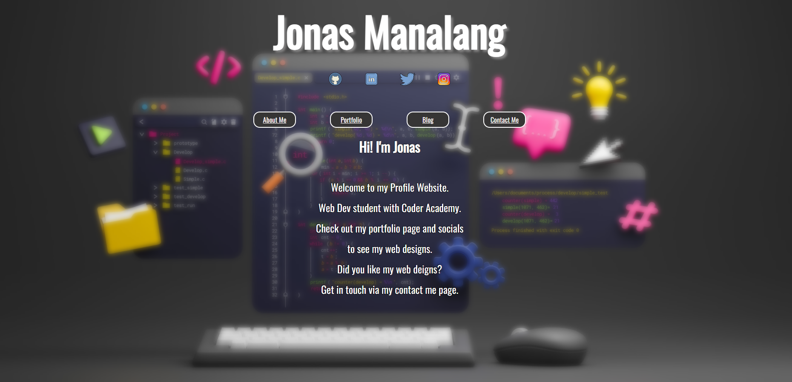

# Jonas Manalang - Assignment 1

[Jonas Manalang Profile Website](https://gleaming-quokka-c67e36.netlify.app/)

[Github Repo](https://github.com/jbm-coder/Assignment1)

[Presentation Video]()

## The Purpose 

## Functionality/Features
- Blog
- Link to Socials
- navigation System
- Contact page/form
- Portfolio

## Sitemap

All of my websites pages have been listed in the site map including all sub-directories, resources and downloads.

What resources needs to be included and if fine to use generator?

## Tech Stack
I used HTML and CSS to create my portfolio website.
I deployed my webiste using netlify starter plan.
I used Github to manage my project version and track the developnment of the project.

