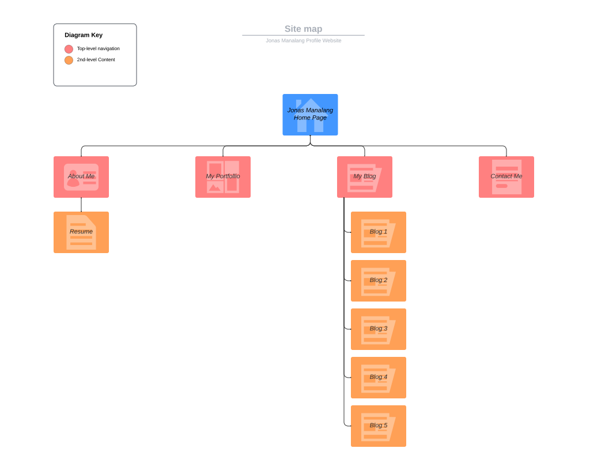
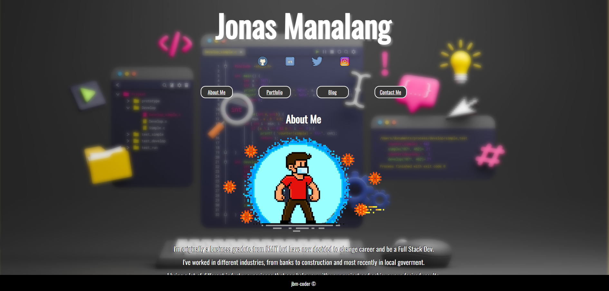
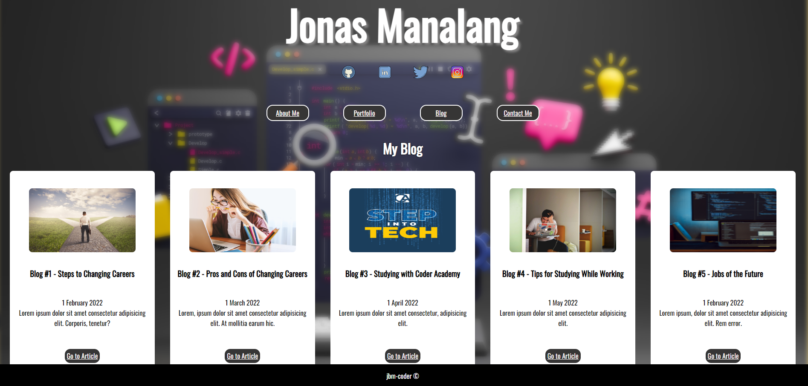
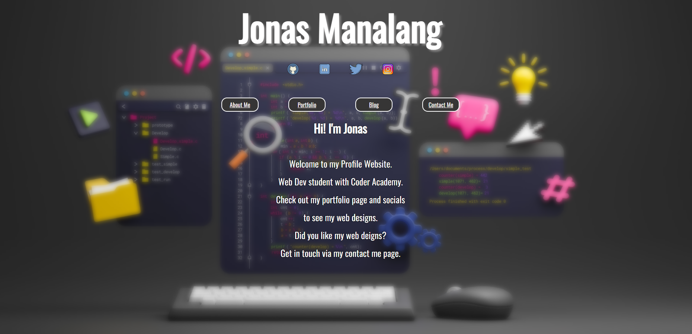

# Assignment 1 - Portfolio Website
##Jonas Manalang

[Jonas Manalang Profile Website](https://jbm-coder.com/)

[Github Repo](https://github.com/jbm-coder/Assignment1)

[Presentation Video](https://youtu.be/Ffp1SId6d74)

## Description
### The Purpose

The purpose of my profile website is to introduce myself to prospective employers and allow them to get to know me personally and professionally whilst also being able to showcase my skillset and my portfolio of work.

### Functionality/Features

- My Fullname as the header which also functions as a link to the home page.
- Link to Socials included.
- Appropriately styled navigation system.
- Contact page/form included.
- Access to my portfolio of work.
- Incorporate a blog system.
- About me page which includes a downloadable resume.

### Sitemap

All of my websites pages have been listed in the site map including all sub-directories and pages.

## Website Screenshots

### Target Audience
My target audience is prospective employers, software developers and also general public who enjoys my designs.
### Tech Stack

I used HTML and CSS to create my portfolio website.
I deployed my webiste using netlify starter plan.
I used Github to manage my project version and track the developnment of the project.

